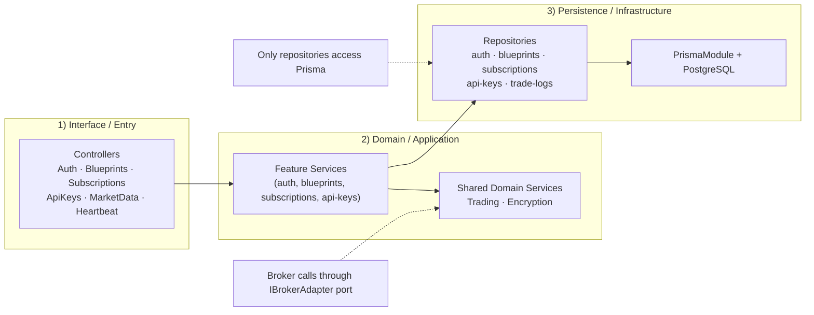

# VanTrade — Presentation Slides Guide

**Format:** 6 minutes, 6 questions (3.1–3.6)  
**Pace:** ~1 minute per section — keep every slide to one clear point  
**Recommended slide count:** 11 slides (excluding title)

---

## Submission Criteria Coverage Check (3.1–3.6)

Use this as a final pre-submission checklist:

- [x] **3.1 What is your project?** Problem + target users clearly stated (Slide 1)
- [x] **3.2 Key architecture characteristics** Quality attributes explained (Slide 2)
- [x] **3.3 Architecture chosen** Architectural styles explicitly named and justified (Slides 3–4)
- [x] **3.4 Why architecture matches requirements** Traceability table from quality attributes to mechanisms (Slide 5)
- [x] **3.5 Code quality** Separation of concerns, modularity, naming, reusable components, error handling, validation, security (Slides 6–7 + examples from Slide 10)
- [x] **3.6 Code structure & organization** Component relationships, DB layers, and CodeCharta visualization (Slides 8–10)

---

## Slide 0 — Title

**Content:**
- Project name: **VanTrade**
- Subtitle: *A Multi-Tenant Algorithmic Trading Strategy Marketplace*
- Team members
- Course name + date

---

## Slide 1 — 3.1 What is your project? *(~45 sec)*

**One-sentence pitch on the slide:**
> Retail traders want to run algorithmic strategies but lack the infrastructure to build and host them. VanTrade solves this by separating the people who write strategies from the people who run them.

**Three-column visual — the three roles:**

| Provider | Tester | Admin |
|---|---|---|
| Publishes RSI or ICT trading blueprints | Subscribes, picks an asset, executes on their Alpaca paper account | Approves blueprints before they go public |

**Talking points:**
- Scoped to **paper trading only** — no real money, no HFT
- Alpaca Paper Trading API as the broker
- Multi-tenant: each tester's credentials and trade history are isolated
- Two strategy types: **RSI mean-reversion** and **ICT / Smart Money Concepts** (multi-timeframe)

---

## Slide 2 — 3.2 Key Architecture Characteristics *(~1 min)*

**Title on slide:** *Quality attributes that drove every design decision*

**Visual — 5-attribute table (use icons if possible):**

| Characteristic | Why it matters for VanTrade |
|---|---|
| **Security** | Users hand us their live brokerage keys — a breach exposes real accounts |
| **Reliability** | One user's bad credentials must never block another user's trade |
| **Auditability** | Users need tamper-proof proof of every fill, hold, and error |
| **Maintainability** | Swapping brokers must not require touching financial calculation logic |
| **Testability** | Trading calculations must be provably correct, not inferred from live runs |

**Talking points:**
- These are the five NFRs from the SRS — every architecture decision maps back to at least one of them
- Security and Auditability are particularly non-negotiable in a financial context (legal, user trust)
- Testability is the property that makes Reliability provable
- **Scope clarification:** hard real-time responsiveness is **not** a primary architecture characteristic for this project
- We run on a heartbeat/interval model and depend on external broker + market-data APIs, so we optimize for **bounded timeliness** (predictable execution windows), not HFT-grade latency

**Suggested sentence to say out loud:**
> "We did not optimize for hard real-time latency; we optimized for secure, reliable, auditable automation with predictable response windows appropriate for paper-trading strategy execution."

---

## Slide 3 — 3.3 System Architecture: The Big Picture *(~1 min)*

**Title on slide:** *Modular Monolith — single quantum, three packages*

**Visual — monorepo diagram:**

```
┌─────────────────────────────────────────────┐
│  pnpm workspaces + Turborepo                │
│                                             │
│  ┌──────────────┐    ┌──────────────────┐  │
│  │  apps/api    │    │   apps/web        │  │
│  │  NestJS API  │    │   Next.js 14      │  │
│  │  port 4000   │    │   port 3000       │  │
│  └──────┬───────┘    └────────┬─────────┘  │
│         │                     │             │
│         └──────────┬──────────┘             │
│              packages/types                 │
│          Shared Zod schemas + types         │
└─────────────────────────────────────────────┘
         ↓ Single deployment quantum
    PostgreSQL (one database)
```

**Talking points:**
- **Modular Monolith** — one deployable unit, but domain-partitioned internally into 10 NestJS feature modules
- **Single architectural quantum**: one API process + one database. Appropriate for current scale; modules are pre-partitioned for extraction if needed
- The `packages/types` shared package is the contract boundary between API and web — changes propagate at compile time

---

## Slide 4 — 3.3 (continued) Hexagonal Architecture *(part of the 1 min above or a quick extra slide)*

**Title on slide:** *Hexagonal Architecture — isolating the trading core*

**Visual — three-layer diagram:**

```
┌─────────────────────────────────────┐
│  DOMAIN — trading.engine.ts         │
│  RSI: calculateRSI()  generateSignal()  calculatePnL()         │  ← Pure functions
│  ICT: generateIctSignal()  detectOrderBlock()  detectFVG()     │     zero imports
└──────────────────┬──────────────────┘
                   │ depends on
┌──────────────────▼──────────────────┐
│  PORT — IBrokerAdapter              │  ← Interface in packages/types
│  getHistoricalPrices()              │
│  placeOrderWithCredentials()        │
└──────────────────┬──────────────────┘
                   │ implemented by
┌──────────────────▼──────────────────┐
│  ADAPTER — alpaca.adapter.ts        │  ← Only file that imports Alpaca SDK
└─────────────────────────────────────┘
```

**Talking points:**
- To swap brokers: write one new adapter file + change one DI binding. Zero changes to domain or heartbeat.
- The domain layer has no `import` from any infrastructure — it can be unit-tested with plain inputs and no mocks
- Two full strategy engines live here: RSI (5 functions) and ICT (9 functions including `generateIctSignal` which orchestrates the full A+ setup checklist)

---

## Slide 5 — 3.4 Why Does This Architecture Match the Requirements? *(~1 min)*

**Title on slide:** *Each quality attribute maps to a concrete mechanism*

**Visual — traceability table:**

| Characteristic | Architecture Decision | Location |
|---|---|---|
| **Security** | AES-256-GCM encryption at rest; in-memory-only decryption | `EncryptionService` |
| **Security** | Server-side RBAC — client cannot self-assign roles | `RolesGuard` + `@Roles()` |
| **Reliability** | `Promise.allSettled` — one failure never blocks others | `HeartbeatService` |
| **Auditability** | Append-only `TradeLog` — no update/delete paths exist | `TradeLogsRepository` |
| **Maintainability** | `IBrokerAdapter` port — broker swap = one file change | `TradingModule` DI binding |
| **Testability** | Pure domain functions — provable with unit tests, no mocks needed | `trading.engine.ts` |

**Talking points:**
- This is the key slide — show that every decision was driven by a requirement, not preference
- Mention the trade-off: e.g., JWTs satisfy stateless reliability but cannot be revoked before expiry
- Single quantum was chosen because: small team + small domain = overhead of microservices not justified

---

## Slide 6 — 3.5 Code Quality: Separation of Concerns *(~1 min)*

**Title on slide:** *Code quality is enforced structurally, not just by convention*

**Visual — layered slice diagram:**

```
HTTP Request
     ↓
┌─────────────────────────────────────┐
│  Controller  — validate + delegate  │  ZodValidationPipe on every endpoint
└──────────────────┬──────────────────┘
                   ↓
┌──────────────────────────────────────┐
│  Service  — business logic only      │  NestJS exceptions, no Prisma
└──────────────────┬───────────────────┘
                   ↓
┌──────────────────────────────────────┐
│  Repository  — Prisma queries only   │  Only file that imports PrismaService
└──────────────────────────────────────┘
```

**Talking points:**
- **Thin Controller Rule**: controllers do exactly three things — validate, call service, return
- **Repository Pattern**: Prisma can only be touched from `*.repository.ts` files — enforced by convention and grep-verifiable
- **Zod at every boundary**: incoming requests validated on the API, outgoing responses validated on the web — same schema, zero drift
- **Naming conventions**: `<feature>.controller.ts`, `<feature>.service.ts`, `<feature>.repository.ts`, and PascalCase React components improve navigability
- **Reusable components**: common UI/backtest utilities were extracted to avoid duplication and improve maintainability
- **Error handling discipline**: NestJS HTTP exceptions (`ConflictException`, `ForbiddenException`, etc.) keep error paths explicit and consistent

---

## Slide 7 — 3.5 (continued) Security & Validation Practices *(quick — fold into Slide 6 if time is tight)*

**Content (bullet list, no diagram needed):**

- **Never trust the client for RBAC** — role is read from JWT, never from request body
- **No `any` types** — TypeScript strict mode across all packages
- **Rate limiting** — `@nestjs/throttler`: 10 req/s burst, 200 req/min sustained
- **Structural fitness functions** — four grep-verifiable import boundary rules enforced in CI:
  - No Prisma outside `*.repository.ts`
  - No Alpaca SDK outside `alpaca.adapter.ts`
  - No business logic in `apps/web`
  - No `any` type
- **80% line coverage gate** on `apps/api/src/trading/`

---

## Slide 8 — 3.6 Code Structure: Module Map *(~1 min)*

**Title on slide:** *Code structure in 3 lanes (not an exhaustive module inventory)*

**Visual — 3-lane architecture map:**



**Talking points:**
- This diagram intentionally shows **relationships and boundaries**, not every file/module
- Left-to-right flow: `apps/web` UI → typed API client → controller → service → repository → PostgreSQL
- Repository layer is the only persistence boundary; business logic stays database-agnostic
- `Trading` and `Encryption` are shared domain services used by multiple feature slices
- Keep the full 10-module inventory as a backup/appendix slide only if asked in Q&A

**Speaker notes (30–40 sec script):**
- "This slide is intentionally not a full module list. It shows the structure rule we follow in every feature."
- "From left to right: requests enter through controllers, services hold business logic, repositories are the only place that talks to Prisma and PostgreSQL."
- "That boundary keeps business logic database-agnostic and easier to test."
- "The shared domain services — Trading and Encryption — support multiple slices without breaking the layering."
- "If you want module-by-module details, we keep the full inventory in the appendix for Q&A."

---

## Slide 9 — 3.6 (continued) Database Schema *(~20 sec)*

**Visual — ER diagram (simplified):**

```
User ──< Blueprint ──< Subscription ──< TradeLog
 └──< ApiKey                               (append-only)
```

**Five tables:**
- `User` — email, hashed password, role
- `Blueprint` — parameters (JSON), isVerified, authorId
- `Subscription` — userId, blueprintId, isActive, **symbolOverride?** (tester's asset choice)
- `ApiKey` — encryptedKey, encryptedSecret, label (AES-256-GCM)
- `TradeLog` — symbol, side (enum), price, quantity, pnl, **status** (broker state / engine reason), executedAt (no updatedAt — append-only)

---

## Slide 10 — CodeCharta Analysis *(~45 sec)*

**Title on slide:** *CodeCharta — Measuring Architectural Health*

**How to explain CodeCharta in one sentence (say this out loud):**
> "CodeCharta combines two metrics — lines of code and number of commits — to find files that are both complex and unstable. Those are your real architectural risks."

**Visual — two-axis diagram (draw or use a 2×2 grid):**

```
         High churn
              │
  Risky       │   ← Hotspot (tall red building)
  but small   │   Large + frequently changed
              │
──────────────┼──────────────  LOC
              │
  Stable &    │   Large but
  small       │   rarely changed (acceptable)
              │
         Low churn
```

**What the colours mean — say this:**
> "The colour scale is always relative to your own project. Red does not mean 'broken' — it means 'the worst in this codebase for this metric'. The goal is to eliminate outliers, not make everything green."

**Why `gitlog.cc.json` alone looks all red:**
> "Every tracked file has at least one commit, so there is no zero-commit anchor at the green end of the scale. Once we merge with the rawtext LOC metrics, the colour reflects size-weighted churn."

**The five hotspots we found and what we did:**

| Building | Architectural Smell | Fix |
|---|---|---|
| `blueprints.service.ts` (471 LOC) | SRP — CRUD + backtest engine in one class | Extracted `BacktestService` → 139 LOC |
| `alpaca.adapter.ts` (473 LOC) | God class — HTTP data + SDK trading + mapping | Extracted `AlpacaMarketDataClient` → 197 LOC |
| `BacktestPanel.tsx` + `BacktestPreviewPanel.tsx` | DRY — 5 functions + 2 components copy-pasted | Extracted to `components/backtest/` + `backtest-formatters.ts` |
| `BlueprintReviewTable.tsx` | High churn from unstable admin boundary | Extracted `useAdmin` hook to absorb changes |

**The intentional coupling — explain this if asked:**
> "`alpaca.adapter.ts` is still somewhat coupled by design. It is the hexagonal architecture adapter — it is *supposed* to be the single integration point for the Alpaca SDK. We reduced unnecessary coupling by extracting HTTP data fetching into `AlpacaMarketDataClient`, but the SDK import, the `IBrokerAdapter` contract, and the order-placement symbol resolution must stay in the adapter. That coupling is the whole point of the pattern."

**Talking points:**
- CodeCharta is used as a **fitness function** — run it after every major refactoring to confirm improvements
- The extracted files (`backtest.service.ts`, `AlpacaMarketDataClient`) start with 1 commit each — they will appear green in the next analysis run
- Show the actual `vantrade.cc.json` loaded in the visualization; set **Color = `rloc`**, **Area = `rloc`**, **Height = `number_of_commits`** to get the most informative view

---

## Slide 11 — Summary / Q&A *(closing, ~15 sec)*

**Content:**
- One-line per decision:
  - Modular Monolith → right-sized for the team and domain
  - Hexagonal Architecture → broker-agnostic, provably correct calculations
  - Repository Pattern → persistence-agnostic business logic
  - Append-only Ledger → tamper-proof audit trail
  - AES-256-GCM → user trust over live brokerage keys
  - RBAC Guards → privilege escalation = direct financial risk

---

## Timing Script

| Slide | Section | Target time |
|---|---|---|
| 0 | Title | 10 sec |
| 1 | 3.1 Project overview | 45 sec |
| 2 | 3.2 Quality attributes | 55 sec |
| 3 | 3.3 Modular monolith | 40 sec |
| 4 | 3.3 Hexagonal architecture | 30 sec |
| 5 | 3.4 Requirements traceability | 55 sec |
| 6 | 3.5 Separation of concerns | 40 sec |
| 7 | 3.5 Security & fitness functions | 20 sec |
| 8 | 3.6 Module map | 35 sec |
| 9 | 3.6 DB schema | 20 sec |
| 10 | 3.6 CodeCharta analysis | 45 sec |
| 11 | Summary | 15 sec |
| **Total** | | **~6 min** |

---

## Key Phrases to Use (Lecture Language)

These terms map directly to the slides so use them explicitly — graders are listening for them:

| Say this | Connects to |
|---|---|
| *"architectural quantum"* | Lecture 05 — single deployable unit |
| *"architecture sinkhole anti-pattern"* | Lecture 06 — thin controller prevents it |
| *"connascence of type"* | Lecture 02/04 — shared Zod package reduces it |
| *"fitness function"* | Lecture 04/11 — grep rules + coverage gate |
| *"ports and adapters"* | Lecture 07 — IBrokerAdapter |
| *"domain partitioning"* | Lecture 05 — 10 feature modules by business domain |
| *"law of continuing change"* | Lecture 01 — why the adapter pattern was chosen |
| *"trade-off"* | Lecture 01 — everything in architecture is a trade-off |

---

## What to Prepare Outside the Slides

1. **CodeCharta visualization** — run the analysis before the presentation so the screenshot is ready for Slide 10.
2. **Live demo (optional)** — if time allows after Q&A, showing the admin role assignment in the browser is a strong proof of the RBAC claim.
3. **One trade-off to mention verbally** — "We chose a monolith over microservices; the trade-off is that the heartbeat competes with HTTP for CPU. We mitigated this with `Promise.allSettled` and a bar cache, and documented the extraction path in our Architecture Quantum section."
