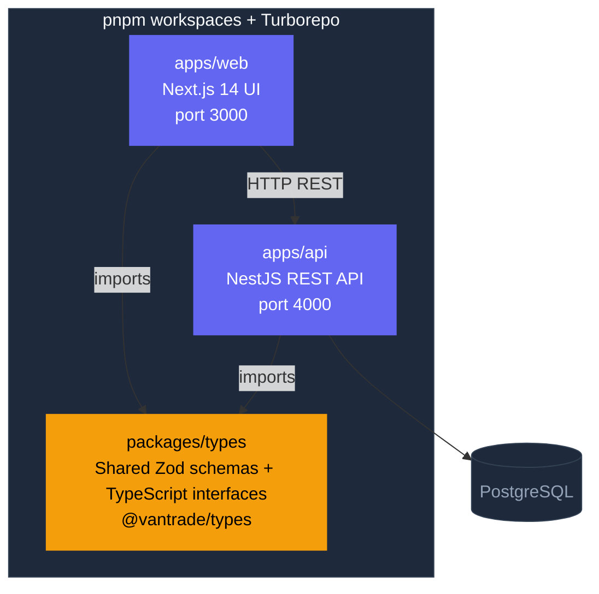
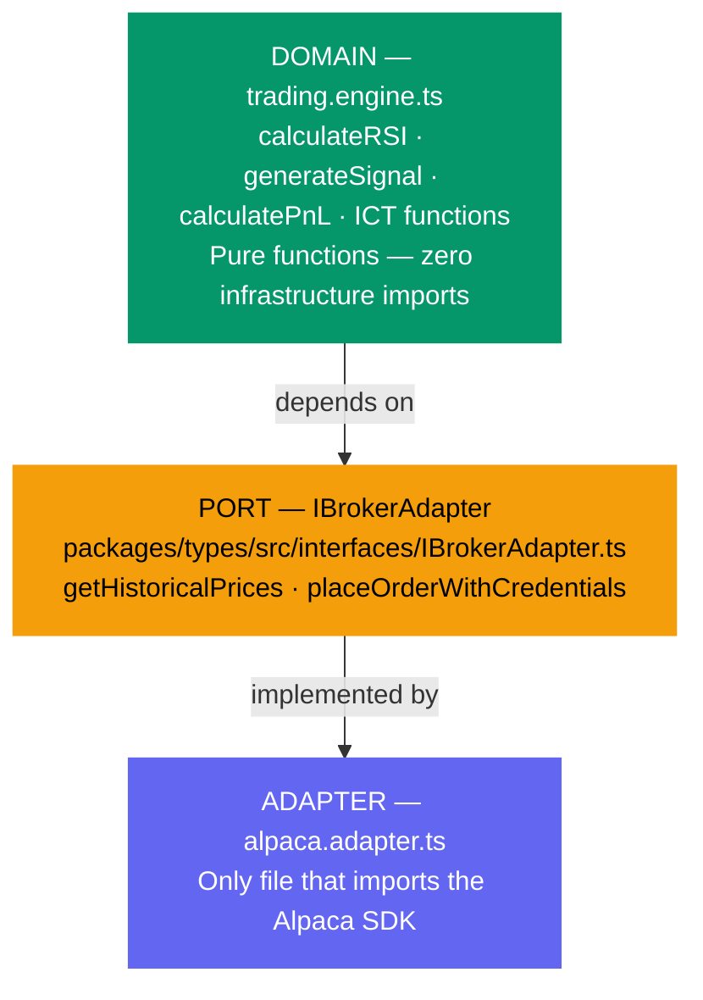
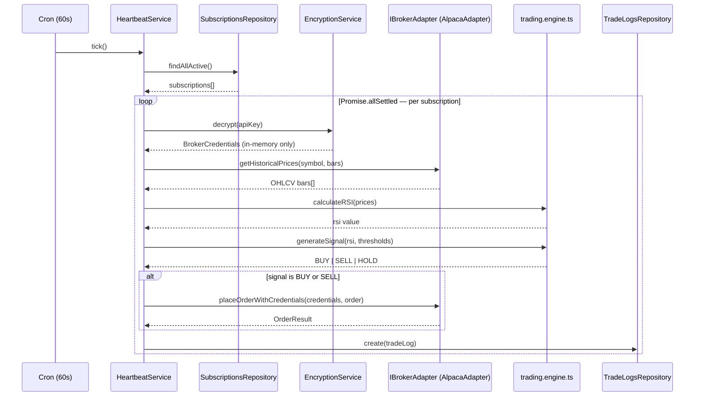
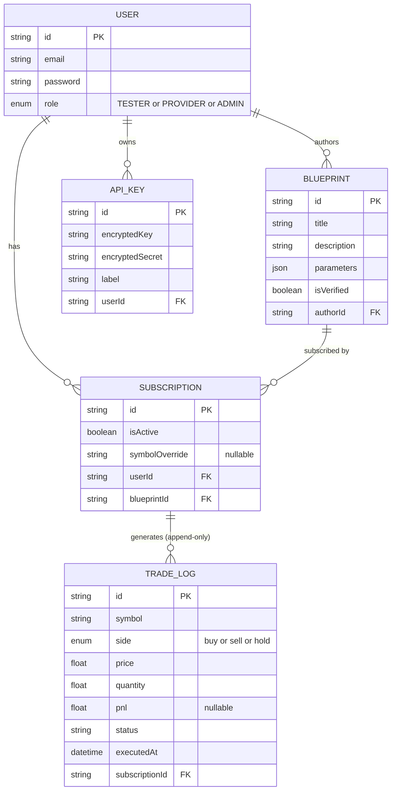
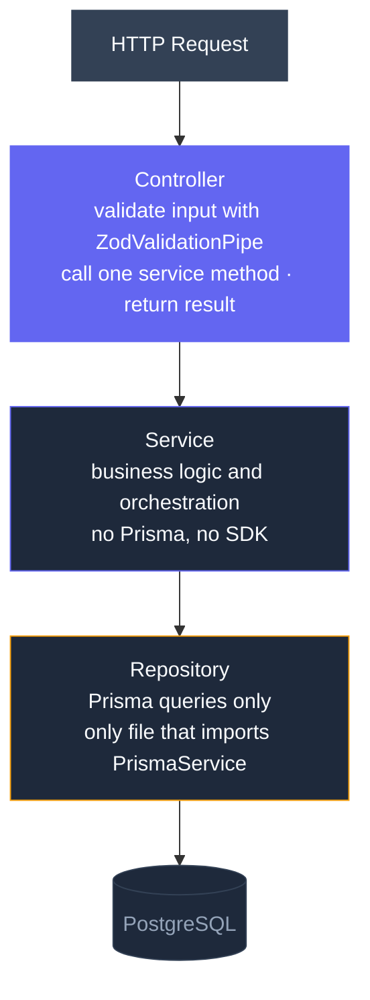

# VanTrade — Architecture Diagrams (Mermaid)

Use these in any Mermaid-compatible renderer (GitHub, Notion, VS Code extension, etc.).

---

## 1. Monorepo Architecture

---

## 2. Hexagonal Architecture (Ports & Adapters)

---

## 3. Heartbeat Execution Pipeline

---

## 4. Database ER Diagram

---

## 5. Request Pipeline — Layered Slice

