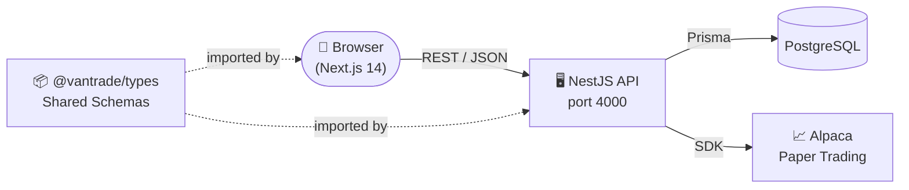
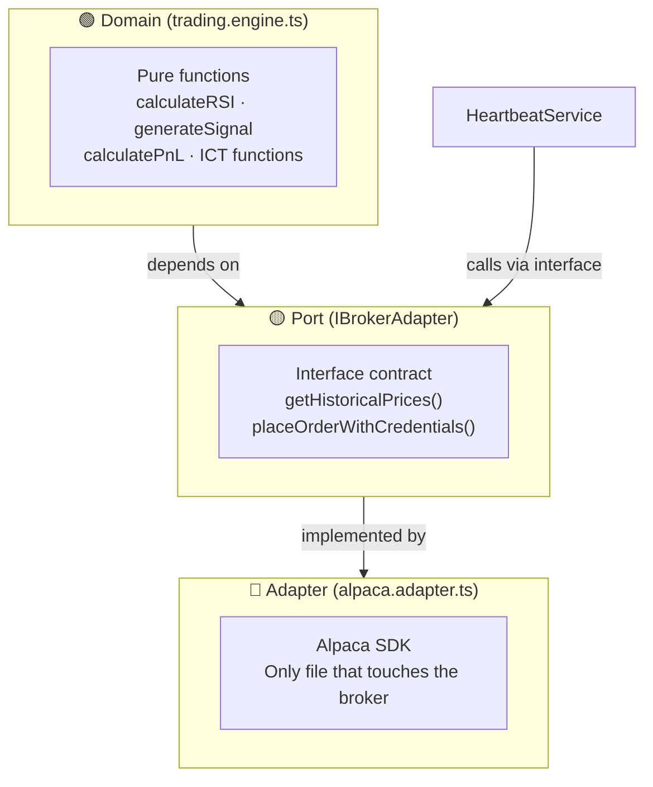
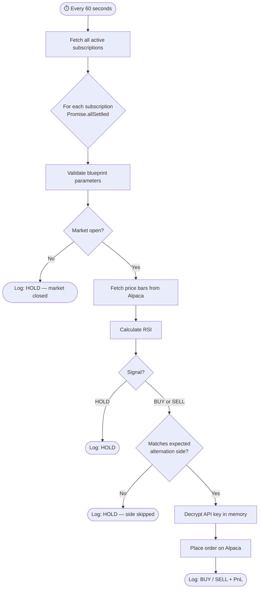
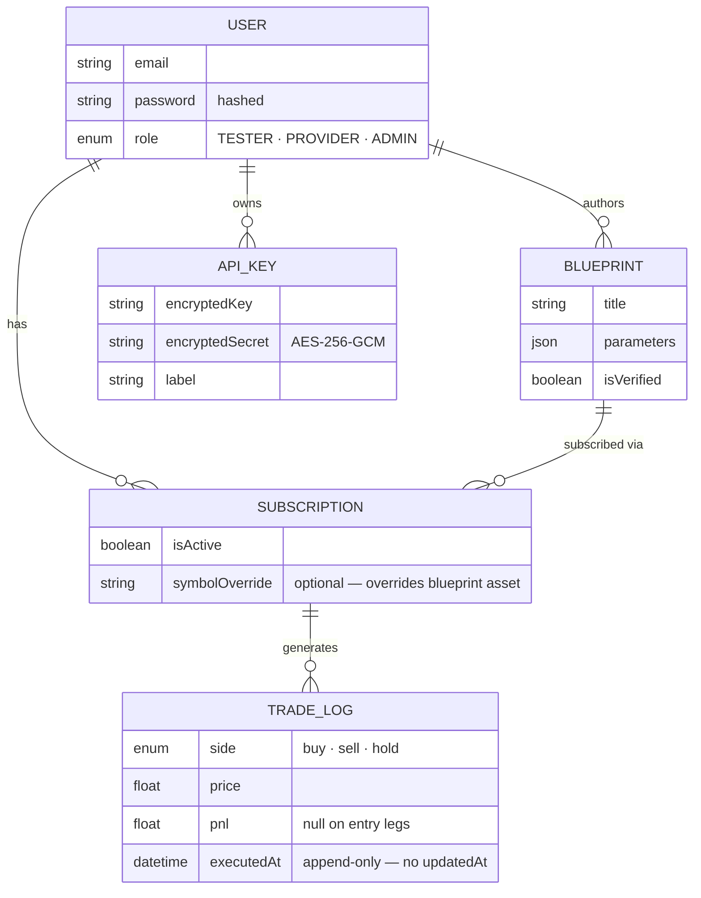
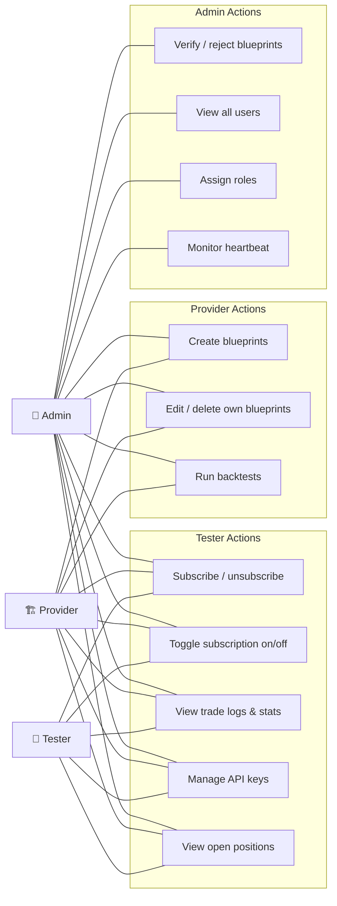
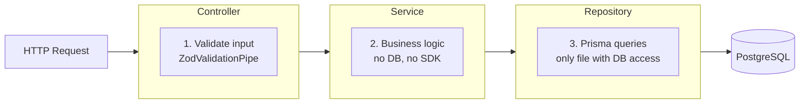
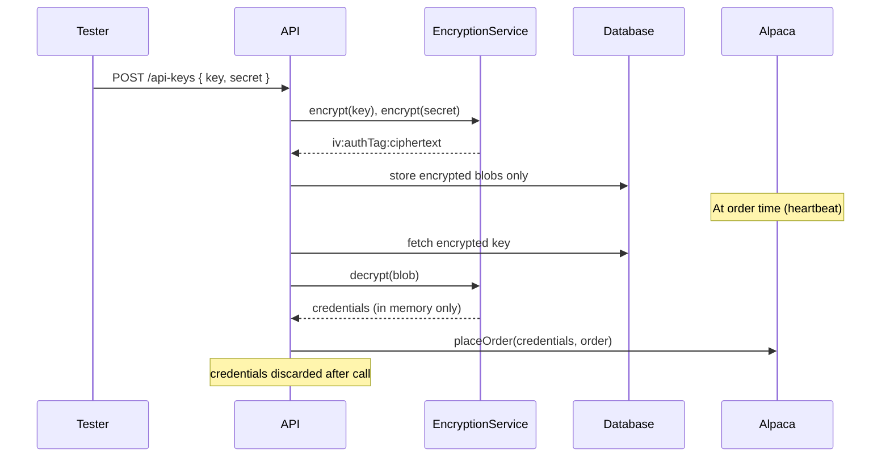

# VanTrade — Architecture Diagrams (Readable)

---

## 1. System Overview

---

## 2. Hexagonal Architecture

---

## 3. Heartbeat Execution Flow

---

## 4. Database Schema

---

## 5. Role & Permission Map

---

## 6. Request Pipeline

---

## 7. Credential Security Flow

